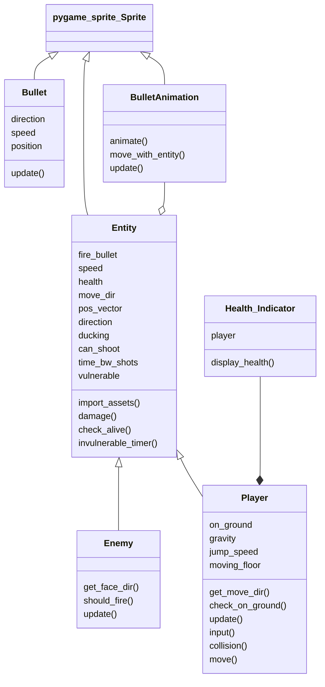

# BulletStorm
- This project is a single-level clone of the classic game `Contra`.

# Object-Oriented Design
- The following class diagram describes the major classes with their important attributes and methods.




## Features
- This is a single-level, single-player game.
- The game features multiple enemies who shoot at the player, moving platforms which the player can use to move onto higher platforms.
- The player has a health indicator.
- The game has sounds which play persistently as well as based on some event (firing a bullet).


## Controls
| Key | Action |
| --- | ------ |
| Up arrow key | Jump |
| Down arrow key | Duck |
| Left arrow key | Move left |
| Right arrow key | Move right |
| Spacebar | Shoot bullets |

## Requirements and Running the Project
- Maps for this game were created using Tiled Map Editor, it uses assets and sounds from multiple sources online.
- The project uses the following libraries as dependencies (can be sourced from https://pypi.org/)
    - pygame
    - os (usually part of Python 3.x installations)
    - math (usually part of Python 3.x installations)
    - sys (usually part of Python 3.x installations)
    - pytmx (https://pypi.org/project/PyTMX/)
- Once the dependencies are installed, you can run the game by:
```
python main.py
```

## Authors
- [@Vidhish-Trivedi](https://github.com/Vidhish-Trivedi)
